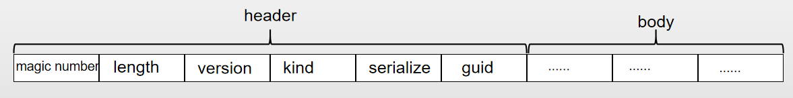
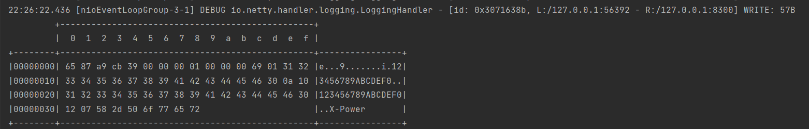

# netty-sample-selfprotocol
Netty与C/C++使用自定义协议进行通信样例。

### 1.协议

格式如下:


| 字段          | 字段名称             | 字节数            | 备注                                                |
| ------------- | -------------------- | ----------------- | --------------------------------------------------- |
| magic number  | 魔数                 | 无符号整数 4 字节 | 0xCBA98765                                          |
| length        | 数据包长度           | 无符号整数 4字节  | 所有字段的长度                                      |
| major version | 主版本号             | 无符号整数 2字节  |                                                     |
| minor version | 次版本号             | 无符号整数 2字节  |                                                     |
| kind          | 数据包类型           | 无符号整数 1字节  | 范围为0~127,如果类型超出这个范围,请使用合适字节长度 |
| serialize     | 序列化类型           | 无符号整数1字节   | 1 protobuf 2 thrift 3 json 4 xml 5 java 6…          |
| guid          | 数据包序列号         | 16字节            | 主要用于数据包追踪                                  |
| byteData      | 消息体(序列化数据块) | N字节             | 包体的数据                                          |

### 2.网络数据大小端

java默认数据是大端的,但是C/C++是小端的,由于神器Netty支持大小端切换,所以我们使用小端来和它们通信.

```java
# com.gisonwin.netty.codec.MessageEecoder
               //读包体长度 LE是小端 little endian
            int length = in.readIntLE();
            log.info("package length =" + length);
            //读取主版本号
            short majorVersion = in.readShortLE();
            //读取次版本号
            short minorVersion = in.readShortLE();
            //读包类型
            byte kind = in.readByte();
            //读取序列化类型,默认为protobuf
            byte serialize = in.readByte();

            //guid 16 bytes
            byte[] guid = new byte[16];
            in.readBytes(guid);

            int dataLength = length - BASE_LENGTH;//后续数据的长度
            // 判断请求数据包数据是否到齐
            int readableBytes1 = in.readableBytes();
            if (readableBytes1 < dataLength) {
                // 还原读指针
                in.readerIndex(beginReader);
                log.error("数据包不完整,{},{}", readableBytes1, dataLength);
                return;
            }
 
```

上述代码片段中 read方法后面加上LE即使用小端读取,LE为little endian 缩写.

### 3.编解码

```java
# 解码器
public class MessageDecoder extends ReplayingDecoder<Void> {
        protected void decode(ChannelHandlerContext channelHandlerContext, ByteBuf in, List<Object> out) throws Exception {
        int BASE_LENGTH = 4 + 4; //HEADER+length 4+4
        int readableBytes = in.readableBytes();
        if (readableBytes > BASE_LENGTH) {  //HEADER+length 4+4 ,可读字节要大于header和包体长度才会解码
                        //读取Header
            int beginReader;
            //一直读数据,直到讲到的数据是header以后,再向后读取数据
            int header;
            while (true) {
                beginReader = in.readerIndex();
                in.markReaderIndex();//标记包头开始的位置
                int readInt = in.readIntLE();

                if ((header = readInt) == MAGIC_NUMBER) {
                    //读到了header, 开始读后面的数据
                    break;
                }
                in.resetReaderIndex();//重置reader index
                in.readByte();
                // 未读到包头，略过一个字节
                // 每次略过，一个字节，去读取，包头信息的开始标记
                // 当略过，一个字节之后，
                // 数据包的长度，又变得不满足
                // 此时，应该结束。等待后面的数据到达
                if (in.readableBytes() < BASE_LENGTH) {
                    return;
                }
            }
            ......
           int dataLength = length - BASE_LENGTH;//后续数据的长度
            // 判断请求数据包数据是否到齐
            int readableBytes1 = in.readableBytes();
            if (readableBytes1 < dataLength) {
                // 还原读指针
                in.readerIndex(beginReader);
                log.error("数据包不完整,{},{}", readableBytes1, dataLength);
                return;
            }     
            ......     
  }
}
```

```java
#编码器
public class MessageEncoder extends MessageToByteEncoder<NettyMessage> {
    @Override
    protected void encode(ChannelHandlerContext channelHandlerContext, NettyMessage msg, ByteBuf out) throws Exception {
        out.writeIntLE(msg.getMagicNumber());//同步字
        out.writeIntLE(msg.getLength());//长度
        out.writeShortLE(msg.getMajorVersion());//主版本号
        out.writeShortLE(msg.getMinorVersion());//次版本号
        out.writeByte(msg.getKind());//包类型
        out.writeByte(msg.getSerialize());//序列化方式
        //将guid byte array 修改为小端 写出去
        byte[] data = EndianUtils.BigEndian16BytesToLittleEndianBytes(msg.getGuid());
        out.writeBytes(data);//guid little endian
        out.writeBytes(msg.getByteData());//写的proto buff的字节流
    }
}    
```

大家注意编码器也是以LE写出去的.和解码器配合就实现了以小端数据流进行通信.

### 4.客户端

```java
package com.gisonwin.netty.client;
public class NettyClientBootstrap {
    //......
        private ChannelFuture start() throws Exception {

        Bootstrap bootstrap = new Bootstrap();
        InetSocketAddress address = new InetSocketAddress(host, port);
        bootstrap.group(eventLoopGroup).channel(NioSocketChannel.class)
                .option(ChannelOption.SO_KEEPALIVE, true)
                .handler(new LoggingHandler(LogLevel.DEBUG))
                .handler(new ClientInitializeHandler());
        ChannelFuture future = bootstrap.connect(address).sync();
        if (future.isSuccess()) {
            socketChannel = (SocketChannel) future.channel();
            logger.info("connect to server {}:{} success", host, port);
            return future;
        }
        return null;
    }
}    
```

主要注意LoggingHandler里的日志级别为DEBUG.该级别会在通信时打印出READ WRITE的详细信息



```java
    public static void main(String[] args) throws Exception {
        int port = 8300;
        String host = "127.0.0.1";
        for (int i = 0; i < 10; i++) {
            //启动10个客户端和服务端通信
            new NettyClientBootstrap(port, host).send();
        }
    }
```

### 5.服务端

```java
@Component
public class NettyTcpServerBootstrap {
    @Value("${tcp.server.port}")
    int port;
    //......
    @PostConstruct
    //@PostConstruct是随着springboot启动时 调用该标识标注的方法.
    public void start() {
        try {
            ServerBootstrap bootstrap = new ServerBootstrap();
            bootstrap.group(bossGroup, workerGroup).channel(NioServerSocketChannel.class)
                    //设置线程队列得到连接个数
                    .option(ChannelOption.SO_BACKLOG, 128)
                    .handler(new LoggingHandler(LogLevel.DEBUG))
                    //设置保持活动连接状态
                    .childOption(ChannelOption.SO_KEEPALIVE, true)
                    //设置NoDelay禁用Nagel,消息会立即发送出去,不用等到一定数量才发送出去
                    .childOption(ChannelOption.TCP_NODELAY, true)
                    //这里的log是boss group的日志级别
                    .handler(new LoggingHandler(LogLevel.DEBUG))
                    .childHandler(new ChannelInitializer<SocketChannel>() {
                        @Override
                        protected void initChannel(SocketChannel ch) {
                            ChannelPipeline p = ch.pipeline();
                            //这里log handler是跟随worker group的日志级别
                            p.addLast(new LoggingHandler(LogLevel.DEBUG));
                            //解码器
                            p.addLast(new MessageEncoder());
                            //编码器
                            p.addLast(new MessageDecoder());
                            //心跳包
//                            p.addLast(new IdleStateHandler(0, 0, 6, TimeUnit.SECONDS));
                            //处理器
                            p.addLast(nettyQueryHandler);
                        }
                    });
            //启动服务器并绑定一个端口且同步生成一个ChannelFuture对象
            ChannelFuture future = bootstrap.bind(port).sync();
            if (future.isSuccess()) {
                logger.debug("Netty Server 启动并监听端口 {}", port);
            }
        } catch (Exception ex) {
            logger.error(ex.toString());
        }
    }
}    
```


### 6.启动

本项目随springboot启动.本代码在openjdk11 & jetbrains idea社区版环境下测试通过.

如果您有疑问或建议,请留言给gisonwin@qq.com,谢谢!